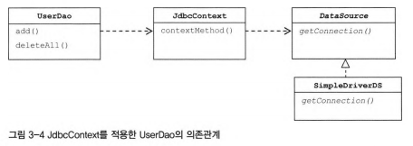
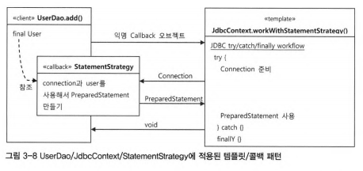

# 3장 템플릿


# 목차

## 3.1 다시 보는 초난감 DAO 

## 3.2 변하는 것과 변하지 않는 것 

## 3.3 JDBC 전략 패턴의 최적화

## 3.4 컨텍스트와 DI

## 3.5 템플릿과콜백 

## 3.6 스프링의 JDBC TEMPLATE


## 3.1 다시 보는 초난감 DAO

### JDBC 조회 기능의 예외처리

```JAVA
public int getCountO throws SQLException {
 Connection c = null；
 PreparedStatement ps = null；
 ResultSet rs = null；
 try {
  c = dataSource.getConnection()；
  ps = c.prepareStatement("select count(*) from users")；
  rs = ps.executeQueryQ；
  rs.nextO；
  return rs.getlnt(1)；
 } catch (SQLException e) {
  throw e；
 } finally {
  if (rs != null) {
   try {
    rs.closeO;
   } catch (SQLException e) {}
  }
  if (ps != null) {
   try {
    ps.closeO；
   } catch (SQLException e) {}
  }
  if (c != null) {
   try {
    c.closeO；
   } catch (SQLException e) {}
  }
 }
}
```

다음과 같은 코드에서 에러가 일어 날 수 있다.

```java
try {
  c = dataSource.getConnection()；
  ps = c.prepareStatement("select count(*) from users")；
  rs = ps.executeQueryQ；
  rs.nextO；
  return rs.getlnt(1)；
}
```

위의 상황이 발생하면 connection이 반환 되지않아 connection pool에 여유가 없어지고, 리소스가 모자란다는 오류를 발생 시킬 수 있다.

그래서 try/catch를 이용한 예외처리를 위와 같은 방법으로 해야한다.


### connection pool?	

- DB와 연결된 커넥션을 미리 만들어 pool에 저장해 두고 있다가 필요할 때 커넥션을 풀에서 쓰고 다시 풀에 반환하는 기법
- 사용자가 많아지면, db연결이 많이 일어나는데 DBCP와 같은 경우는 미리 DB와 연결된 객체를 만들어 놓고, 사용자가에 빌려주는 개념이다.
- 서버에는 동시접속자 수라는 한계가 있는데, 이를 넘어서면 client를 대기 상태로 전환시킨다. 이 후 connection pool에 connection이 돌아오면 대기자에게 connection을 준다.


## 3.2 변하는 것과 변하지 않는 것


### JDBC try/catch/finally의 문제점

- 너무 중괄호가 많고, 코드가 길어지면 헷갈린다. 이를 디자인 패턴으로 극복해보자

### 템플릿 메소드 패턴 

- 상위 클래스에서 처리의 흐름을 정의하고, 하위 클래스에서 처리 내용을 구체화 한다.

- 여러 클래스에서 사용되는 공통적인 부분은 상위 추상 클래스에서 구현하고, 각각 상세부분은 하위 클래스에서 구현한다.

  ```java
  public class UserDaoDeleteAll extends UserDao {
      protected PreparedStatement makeStatement(Connection c) throws SQLException {
          PreparedStatement ps = c.prepareStatement("delete from users")；
          return ps；
      }
  }
  ```


### 전략패턴 - 실행 중에 알고리즘을 선택할 수 있게 한다.

- OCP를 잘지키는 구조이다.
- OCP
  - 확장에 대해 열려 있다. ( 새로운 동작을 추가해 모듈을 확장할 수 있다.)
  - 수정에 대해 닫혀 있다. ( 모듈의 소스코드나 바이너리를 수정하지 않아도, 기능을 확장하거나 변경할 수 있다.)

  


  Strategy를 만들고, Strategy를 실행할 Context를 만든다.

### Strategy(interface)

```java
public interface Strategy {
    void runStrategy();
}
```


### ConcreteStrategyA,B

```java
public class StrategyGrenade implements Strategy{
 
    @Override
    public void runStrategy() {
        // TODO Auto-generated method stub
        System.out.println("수류탄 투척~! 쾅!!!!");
         
    }
 
}

public class StrategyGun implements Strategy{
 
    @Override
    public void runStrategy() {
        // TODO Auto-generated method stub
        System.out.println("탕! 타탕! 탕탕!");
         
    }
 
}
```


### Context

```java
public class Solider {
    void runContext(Strategy strategy) {
        System.out.println("배틀 그라운드 시작");
        strategy.runStrategy();
        System.out.println("배틀 종료");
    }
}
```


### Client

```java
public class Client {
 
    public static void main(String[] args) {
        Strategy strategy = null;
        Solider rambo = new Solider();
        strategy = new StrategyGun();
         
        rambo.runContext(strategy);
         
        System.out.println("\n");
        strategy = new StrategyGrenade();
         
        rambo.runContext(strategy);
    }
 
}
```


### Strategy와 template method pattern의 차이점???

- Strategy는 실행시간(clinent)에서 stategy를 상황에 맞게 변경할 수 있다.
- template와는 다르게 context의 전략을 바꿀 수 있다. 
- template는 새로운 전략을 짜려면 새로운 클래스를 만들어야 하지만, 아 모르겠다.


**Stategy pattern에서 어떤 Strategy를 선택할 것인지는 context를 사용하는 앞단의 client가 결정하는 것이 일반적이다**. 그래서 패턴을 적용하여 try/catch/finally를 제거한 코드는 다음과 같다.


### Concrete Strategy

```java
package springbook.user.dao;
public class DeleteAllStatement implements StatementStrategy {
 @Override
 public PreparedStatement makePreparedStatement(Connection c) throws
 SQLException {
  PreparedStatement ps = c.prepareStatement("delete from users")；
  return ps；
 }
}
```


### Context(parameter로 strategy를 넣어준다.)

```java
public void jdbcContextWithStatementStrategy(StatementStrategy stmt) throws SQLException {
 Connection c = null；
 PreparedStatement ps = null；

 try {
  c = dataSource.getConnection()；
  ps = stmt.makePreparedStatement(c)；
  ps.executeUpdateO；
 } catch (SQLException e) {
  throw e；
 } finally {
  if (ps != null) {
   try {
    ps.closeO；
   } catch (SQLException e) {}
  }
  if (c != null) {
   try {
    c.closeO；
   } catch (SQLException e) {}
  }
 }
    
}
```


### Client

```java
public void deleteAllO throws SQLException {
 StatementStrategy st = new DeleteAllStatement();
 jdbcContextWithStatementStrategy(st)；
}
```


## 3.2 JDBC 전략 패턴의 최적화

add()도 메소드도 마찬가지 이다. 다만 add할때 user의 정보가 필요하다. 그 부분은 생성자함수에 user정보를 parameter로 받아 해결한다.


### Contrete Strategy

```java
package springbook.user.dao；
public class AddStatement implements StatementStrategy {
 User user；
 public AddStatement(User user) {
  this.user = user；
 }
 public PreparedStatement makePreparedStatement(Connection c) {
  ps.setString(1, user.getldO)；
  ps.setString(2, user.getNameO)；
  ps.setString(3, user.getPasswordO)；
   ...
 }
}
```

위에는 2가지 불편한 점이 있다.

1. DAO메소드마다 새로운 StatementStrategy 구현 클래스를 만들어야 한다.
2. DAO메소드에서 user와 같은 전달받는 변수를 번거롭게 만들어야한다.


이 문제들은 내부 클래스를 만들어 내부클래스에서 외부 user변수를 접근하도록 하면 된다.

```
왜 메소드안에 내부클래스를 넣는가?
```


### Client ( client + contrete strategy)

```java
public void add(final User user) throws SQLException {
  class AddStatement implements StatementStrategy {
   public PreparedStatement makePreparedStatement(Connection c)
   throws SQLException {
    PreparedStatement ps = c.prepareStatement(
     "insert into users(id, name, password) values( ? , ? , ? )" )；
     ps.setString(1, user.getldO)； 
     ps.setString(2, user.getNameO)； 
     ps.setString(3, user.getPasswordO)； 
     return ps；     
   }
  }
     StatementStrategy st = new AddStatementO； 
     userS JdbcContextWi thStatementStrategy(st)；
}
```


위에서 AddStatement클래스는 add()메소드에서만 사용할 수 있으므로 익명 내부클래스로 정의할 수 있다.

```java
StatementStrategy st = new StatementStrategy() {
 public PreparedStatement makePreparedStatement(Connection c) throws SQLException {
  PreparedStatement ps =
   c.prepareStatement("insert into users(id, name, password) values( ? ? ? )");
  ps.setStringd, user.getld())；
  ps.setString(2, user.getName())；
  ps.setstring(3, user.getPassword())；
  return ps；
 }
}；
```


```java
public void add(final User user) throws SQLException {
 jdbcContextWithStatementStrategy(
  new StatementStrategy() {
   public PreparedStatement makePreparedStatement(Connection c) throws SQLException {
    PreparedStatement ps =
     c.prepareStatement("insert into users(id, name,password) values( ? , ? , ? )");
    ps.setString(1, user.getldO)；
    ps.setString(2, user.getNameO)；
    ps.setstring(3, user.getPasswordO)；
    return ps；
   }
  }
 };
}
```


## 3.4 컨텍스트와 DI

jdbcContextWithStatementStrategy() 는 다른 DAO에서도 사용 가능하다. 그래서 메소드를 UserDao 밖으로 독립시켜서 모든 DAO가 사용할 수 있게 해보자


### 클래스 분리

분리할 클래스 이름을 JdbcContext라고 한다. JdbcContextWithStatementStrategy() -> workWithStatementStrategy()라는 이름으로 바꾼다. 

이렇게 되면 DataSource가 필요한 것은 UserDao가 아니라 JdbcContext가 된다. 

그래서 JdbcContext가 DataSource에 의존하고 있으므로 DataSource 타입 빈을 DI 받을 수 있게 해야한다.


### JdbcContext

```java
package springbook.user.dao;
public class JdbcContext {

 private DataSource dataSource;
     
 public void setDataSource(DataSource dataSource) {
  this.dataSource = dataSource；
 }
 public void workWithStatementStrategy(StatementStrategy stmt) throws SQLException {
  Connection c = null；
  PreparedStatement ps = null；
  try {
   c = this.dataSource.getConnection()；
   ps = stmt.makePreparedStatement(c)；
   ps.executeUpdateO；
  } catch (SQLException e) {
   throw e；
  } finally {
   if (ps != null) {
    try {
     ps.closeO；
    } catch (SQLException e) {}
   }
   if (c != null) {
    try {
     c.closeO；
    } catch (SQLException e) {}
   }
  }
 }
}
```


### UserDao

```java
public class UserDao {
 ...
 private JdbcContext jdbcContext；
 public void set3dbcContext(JdbcContext jdbcContext) {
  this.jdbcContext = jdbcContext；
 }

 public void add(final User user) throws SQLException {
  this.jdbcContext.workWithStatementStrategy(
   new StatementStrategyO { ... }
  );
 }
    
 public void deleteAllO throws SQLException {
  this.jdbcContext.workWithStatementStrategy(
   new StatementStrategyO { ... }
  );
 }
    
}
```

UserDao가 JdbcContext에 의존하게 되면서 의존관계가 다음과 같이 변화하였다.


그래서 빈을 수정해주어야 한다.

```xml
<?xml version="1.0" encoding="UTF-8"?>
<beans
    xmlns="http：//www.springframework.org/schema/beans"
xmlns :xsi="http ： " www.w3.org/2001 /XMLSchema-instance"
xsi ： schemaLocat ion=Mhttp ： //www. springframework.org/schema/beans
http://www.springframework.org/schema/beans/spring-beans.xsd">
    <bean id="userDao" class="springbook.user.dao.UserDao">
        <property name="dataSource" ref="dataSourcen" />
        <property name="jdbcContext" ref="jdbcContext" />
    </bean>
    <bean id="jdbcContext" class="springbook.user.dao.DdbcContext">
        <property name="dataSource" ref="dataSource" />
    </bean>
    <bean id="dataSource" class="org.springframework.jdbc.datasource.SimpleDriverDataSo니rce" >		</bean>
</beans>
```


## 3.4.2 JdbcContext의 특별한 DI

UserDao와 JdbcContext 사이에는 인터페이스를 사용하지 않고 DI를 적용했다. 클래스 레벨에서 의존관계가 성립되었다. 기존의 인터페이스를 이용하여 결합성을 낮춘것과는 방법이 조금 다르다. 

그래서 온전한 DI라고 보기는 힘들지만, 스프링 DI는 객체생성과 관계설정에 대한 제어권을 외부로 위임했다는 IoC라는 개념을 포괄하기 때문에 DI의 기본을 따른다고 볼 수 있다.

인터페이스를 사용하지않고, DI 구조로 UserDao와 JdbcContext만들어야할 이유는 2가지 이다.

1. JdbcContext가 스프링 컨테이너의 싱글톤 레지스트리에서 관리되는 싱글톤 빈이기 때문....
   - 스프링 빈으로 만들어 싱글톤으로 관리되는 것이 여러 오브젝트에서 공유될 수 있어서 이득이다.
2. JdbcContext가 DI를 통해 다른 빈에 의존하고 있기 때문..

**UserDao는 항상 JdbcContext클래스와 함께 사용되어야 한다. 함께 계속 결합되어 있다는것은 강한 응집도를 갖는다는 의미와 같다.**


### 코드를 이용해 수동으로 DI를 하는 방법

JdbcContext를 스프링 빈으로 등록하지 않고, UserDao 내부에서 직접 DI를 구현하는 방법이 있다. 그렇게 되면 JdbcContext 생성과 초기화를 UserDao가 가지게 된다.

그래서, UserDao에게 JdbcContext를 생성하고, 의존 오브젝트를(DataSource) 수정자 메소드로 주입해주어야 한다. 이는 UserDao가 DI Factory처럼 동작하게 된다.

그러니까 기존이 아래의 방식이었다. 둘다 빈으로 등록하는 방식

**UserDao -> JdbcContext**  **, dbcContext -> DataSource**

````java
public class UserDao {
 private JdbcContext jdbcContext；
 public void set3dbcContext(JdbcContext jdbcContext) {
   this.jdbcContext = jdbcContext；

   public void add(final User user) throws SQLException {
     this.jdbcContext.workWithStatementStrategy(
      new StatementStrategyO { ...
      }

     )；
   }
     public void deleteAllO throws SQLException {
      this.jdbcContext.workWithStatementStrategy(
       new StatementStrategyO { ...
       }
      )；
     }
 }
}
````

```java
package springbook.user.dao;
public class JdbcContext {
 private DataSource dataSource；

 public void setDataSource(DataSource dataSource) {
  this.dataSource = dataSource；
  public void workWithStatementStrategy(StatementStrategy stmt) throws
  SQLException {
   Connection c = null；
   PreparedStatement ps = null；

   try {
    c = this.dataSource.getConnection()；
    ps = stmt.makePreparedStatement(c)；
    ps.executeUpdateO；
   } catch (SQLException e) {
    throw e；
   } finally {
    if (ps != null) {
     try {
      ps.closeO；
     } catch (SQLException e) {}
    }
    if (c != null) {
     try {
      c.closeO；
     } catch (SQLException e) {}
    }
   }
  }
 }
}
```

UserDao가 DI Factory역할을 하여 JdbcContext에 DataSource를 주입해준다.

그러면 다음과 같은 관계가 된다.



```xml
<beans>
    <bean id = "userDao " class="springbook.ser.dao.UserDao ">
        <property name = "dataSource" ref="dataSource " />
    </bean>
    <bean id = "dataSource"class = "org.springframework.idbc.datasource.Si[npleDriverDataSource" >		</bean>
</beans>
```

```java
public class UserDao {
 private JdbcContext jdbcContext；
 public void setDataSource(DataSource dataSource) {
  this.jdbcContext = new dbcContext();
  this.jdbcContext.setDataSource(dataSource)；
  this.dataSource = dataSource
 }
}
```


즉, 정리하자면

JdbcContext를 인터페이스를 사용하지 않고, DAO와 밀접한 관계를 가지는 클래스를 DI에 적용하는 방법 2가지이다.

1. 빈으로 등록하는 방법
   - 오브젝트 사이의 의존관계가 bean 설정파일로 명확하게 드러난다.
   - DI의 근본적인 관계에 부합하지않은 관계가 설정에서 노출된다.
2. 코드를 이용해 수동으로 DI를 하는 방법
   - JdbcContext가 UserDao의 내부에서 만들어지고 사용되면서 그 관계를 외부에는 드러내지 않는다.
   - 싱글톤으로 JdbcContext를 만들 수 없고, DI작업을 위한 부가적인 코드가 필요하다.


# 3.5 템플릿과 콜백

지금까지의 UserDao, StatementStrategy, JdbcContext를 이용했던 방법은 전략패턴의 기본구조에 annomymous inner class를 활용한 방식이다. 이를 스프링에서는 템플릿/콜백 패턴이라고 한다.

Context(템플릿), annomymous inner class로 만들어진 obj를 콜백이라고 한다.

여러 메소드를 가진 인터페이스를 사용할 수 있는 전략패턴과는 달리, 템플릿/콜백은 단일 메소드 인터페이스를 사용한다.(db연결과 같은 특정기능을 위해 한번만 호출되기 때문이다.)


### JdbcContext에 적용된 템플릿/콜백




### client

```java
userDao.deleteAll();
```


### callback

```java
public class UserDao {
 ...
 private JdbcContext jdbcContext；
 public void set3dbcContext(JdbcContext jdbcContext) {
  this.jdbcContext = jdbcContext；
 }

 public void add(final User user) throws SQLException {
  this.jdbcContext.workWithStatementStrategy(
   ...
  );
 }

 public void deleteAllO throws SQLException {
  this.jdbcContext.workWithStatementStrategy(
   new StatementStrategyO {
    public PreparedStatement makePreparedStatement(Connection c) throws SQLException {
     return c.prepareStatement("delete from users")；
    }
   }
  );
 }

}
```


### Context(template)

```java
package springbook.user.dao;
public class JdbcContext {

 private DataSource dataSource；
 public void setDataSource(DataSource dataSource) {
  this.dataSource = dataSource；
 }
 
 public void workWithStatementStrategy(StatementStrategy stmt) throws SQLException {
  Connection c = null；
  PreparedStatement ps = null；
  try {
   c = this.dataSource.getConnection()；
   ps = stmt.makePreparedStatement(c)；
   ps.executeUpdateO；
  } catch (SQLException e) {
   throw e；
  } finally {
   if (ps != null) {
    try {
     ps.closeO；
    } catch (SQLException e) {}
   }
   if (c != null) {
    try {
     c.closeO；
    } catch (SQLException e) {}
   }
  }
 }
}
```


DAO 메소드마다 내부클래스가 있어서 가독성이 떨어진다. SQL문은 변하는 부분이므로 따로 메서드로 빼자.

```java
public void deleteAllO throws SQLException {
 executeSql("delete from users");
}

//callback method
private void executeSql(final String query) throws SQLException {
 this.jdbcContext.workWithStatementStrategy(
  new StatementStrategyO {
   public PreparedStatement makePreparedStatement(Connection c)
   throws SQLException {
    return c.prepareStatement(query)；
   }
  }
 );
}
```

더 나아가, executeSql은 재사용 가능한 callback을 가지고 있기 때문에 UserDao에서만 쓰기 아깝다. 그래서 JdbcContext에 합칠 수 있다.

```java
package springbook.user.dao;
public class JdbcContext {

 ...

 public void workWithStatementStrategy(StatementStrategy stmt) throws SQLException {
  ...
 }

 public void deleteAllO throws SQLException {
  executeSql("delete from users");
 }
 //callback method
 private void executeSql(final String query) throws SQLException {
  this.jdbcContext.workWithStatementStrategy(
   new StatementStrategyO {
    public PreparedStatement makePreparedStatement(Connection c)
    throws SQLException {
     return c.prepareStatement(query)；
    }
   }
  );
 }

}
```

일반적으로 성격이 다른 코드들은 분리하는 편이 낫지만, 이 경우는 응집도를 높히는 것이 더 좋다.


## 3.5.3 템플릿/콜백의 응용

고정된 작업흐름을 가지면서 여기저기서 자주 반복되는 코드가 있다면, 중복되는 코드를 분리할 방법을 생각하자

1. 중복된 코드는 메소드로 분리
2. 인터페이스를 사이에 두고 전략패턴을 적용하여 DI로 의존관계를 관리
3. 템플릿/콜백 패턴을 적용시킨다.

#### 예시) 파일을 읽어서 각 라인의 수를 더하는 프로그램

```java
package springbook.learningtest.template；
public class CalcSumTest {
 @Test
 public void sumOfNumbers() throws IOException {
  Calculator calculator = new Calculator();
  int sum = calculator.calcSum(getClass().getResource("numbers. txt").getPath〇)；
  assertThat(sum, is(10))；
 }
}
```

```java
package springbook.learningtest.template；
public Integer calcSum(String filepath) throws IOException {
 BufferedReader br = null；
 try {
  br = new BufferedReader(new FileReader(filepath))；
  Integer sum = 0；
  String line = null；
  while ((line = br.readLineO) != null) {
   sum += Integer.valueOf(line)；
  }
  return sum；
 } catch (IOException e) {
  System.out.println(e.getMessageO)；
  throw e；
 }
 finally {
  if (br != null) {
   try {
    br.closeO；
   } catch (IOException e) {
    System.out.printIn(e.getMessage())；
   }
  }
 }
}
```

하지만, 여기서 숫자의 곱을 계산하는 기능 등이 추가되면 어떻게 할 것인가?


### 템플릿/콜백 패턴 적용

템플릿이 콜백에게 전달하는 내용이 무엇인지 파악하는게 중요하다. 여기서는 템플릿으로 파일을 열고, 각 라인을 읽어올 수 있는 BufferedReader를 콜백에게 전달해준다. 그리고 처리 후에 최종 결과만 템플릿에 돌려준다.

### Template

```java
public Integer fileReadTemplate(String filepath, BufferedReaderCallback callback)
throws IOException {
 BufferedReader br = null；
 try {
  br = new BufferedReader(new FileReader(filepath))；
  int ret = callback.doSomethingWithReader(br);
  return ret;
 } catch (IOException e) {
  System,
  out.println(e.getMessage〇)；
  throw e；
 }
 finally {
  if (br != null) {
   try {
    br.closeO；
   } catch (IOException e) {
    System.out.println(e.getMessage());
   }
  }
 }
}
```


### Callback

```java
public Integer calcSum(String filepath) throws IOException {
 BufferedReaderCallback sumCallback =
  new BufferedReaderCallback() {
   public Integer doSomethingWithReader(BufferedReader br) throws IOException {
    Integer sum = 0；
    String line = null；
    while ((line = br.readLineO) != null) {
     sum += Integer.va1ueOf(line)；
    }
    return sum；
   }
  }；
 return fileReadTemplate(filepath, sumCallback)；
}
```

### CallBack(multiply)

```java
public Integer calcMultiply(String filepath) throws IOException {
 BufferedReaderCallback multiplyCallback =
  new BufferedReaderCallback() {
   public Integer doSomethingWithReader(BufferedReader br) throws
   IOException {
    Integer multiply = 1;
    String line = null；
    while ((line = br.readLineO) != null) {
     multiply *= Integer.valueOf(line)；
    }
    return multiply；
   }
  }；
 return fi1eReadTemp1ate(fi1epath, multiplyCallback)；
}
```

### Test

```java
package springbook.learningtest.template；
public class CalcSumTest {
 Calculator calculator；
 String numFilepath；
 @Before
 public void setUp() {
  this.calculator = new Calculator。；
  this.numFilepath = getClass().getResource("numbers.txt").getPath()；
 }
 @Test
 public void sumOfNumbersO throws IOException {
  assertThat(calculator.calcSum(this.numFilepath), is(10))；
 }
 @Test
 public void multiplyOfNumbersO throws IOException {
  assertThat(calculator.calcMultiply(this.numFilepath)# is(24))；
 }
}
```


하지만 위의 callback을 보면 한줄빼고 다 같다. 이를 분리해보자

### callback interface

````java
package springbook.learningtest.template；
public interface LineCallback {
 Integer doSomethingWithLine(String line, Integer value)；
}
````


### Template

```java
public Integer lineReadTemplate(String filepath, LineCallback callback, int initVal) throws IOException {
 BufferedReader br = null；

 try {
  br = new BufferedReader(new FileReader(filepath))；
  Integer res = initVal；
  String line = null；
  while ((line = br.readLineO) != null) {
   res = callback.doSomethingWithLine(line, res)；
  } catch (IOException e) {} finally { ...
  }
 }
}
```


### callback

```java
public Integer calcSum(String filepath) throws IOException {
 LineCallback sumCallback =
  new LineCallbackO {
   public Integer doSomethingWithLine(String line, Integer value) {
    return value + Integer.valueOf(line)；
   }
  }；
 return lineReadTemplate(filepath, sumCallback, 0)；
}

public Integer calcMultiply(String filepath) throws IOException {
 LineCallback multiplyCallback =
  new LineCallbackO {
   public Integer doSomethingWithLine(String line, Integer value) {
    return value * Integer.valueOf(line)；
   }
  }；
 return lineReadTemplate(filepath, multiplyCallback, 1)；
}
```


제네릭을 이용해서 숫자를 합하는 것뿐 아니라, 파일의 문자를 합쳐 문자열을 만드는 기능을 추가할 수 있다.

### interface

```java
public interface LineCallback < T > {
 T doSomethingWithLine(String line, T value)；
}
```

### Template

```java
public < T > T lineReadTemplate(String filepath, LineCallback < T > callback, T initVal)
throws IOException {
 BufferedReader br = null；
 try {
  br = new BufferedReader(new FileReader(filepath))；
  T res = initVal；
  String line = null；
  while ((line = br.readLineO) != null) {
   res = callback.doSomethingWithLine(line, res)；
  }
  return res；
 } catch (IOException e) { ... } 
 finally { ... }
}
```

### callback

```java
public String concatenate(String filepath) throws IOException {
 LineCallback < String > concatenateCallback =
  new LineCallback < String > () {
   public String doSomethingWithLine(String line, String value) {
    return value + line；
   }
  };
 return lineReadTemplate(filepath, concatenateCallback, "")；
}
```


# 3.6 스프링의 JdbcTemplate

스프링에서는 JdbcContext보다 더 강력한 JdbcTemplate를 제공해준다. JdbcTemplate를 적용하면 다음과 같이 변화한다.

## 3.6.1 update()

### before

```java
public class UserDao {
 ...
 public void deleteAllO throws SQLException {
  this.jdbcContext.workWithStatementStrategy(
   new StatementStrategyO {
    public PreparedStatement makePreparedStatement(Connection c) throws SQLException {
     return c.prepareStatement("delete from users")；
    }
   }
  );}
}
```


### after(inner class를 이용한 callback)

가독성이 떨어진다고 해서 executeSql()메소드를 만듬.

```java
public void deleteAllO {
 this.jdbcTemplate.update(
  new PreparedStatementCreator() {
   public PreparedStatement createPreparedStatement(Connection con)
   throws SQLException {
    return con.prepareStatement("delete from users")；
   }
  }
 )；
}
```

### after(내장 콜백을 이용)

```java
public void deleteAllO {
 this.jdbcTemplate.update("delete from users")；
}
```


add()도 편하게 할 수 있다.

```java
public void add() {
 this.jdbcTemplate.update("insert into users(id, name, password) values(?,?,?)", user.getldO, user.getName(), user.getPassword())；
}
```


## 3.6.2 queryForInt()

SQL 쿼리를 실행하고, ResultSet을 통해 결과값을 가져오는 코드를 간단히 할 수 있다.

### before

```java
public int getCount() { 
  return this.jdbcTemplate.query(new PreparedStatementCreator() {
    public PreparedStatement createPreparedStatement(Connection con)
    throws SQLException {
     return con.prepareStatement("select count(*) from users")；
     
    }, new ResultSetExtractor < Integer > () {
     public Integer extractData(ResultSet rs) throws SQLException,
      DataAccessException {
       rs.nextO；
       return rs.getlnt(1)；
      }
    })；
  }
}
```

### after

```java
public int getCountO {
 return this.jdbcTemplate.queryForInt("select count(*) from users")；
}
```


## 3.6.3 queryForObject()

get() - 사용자의 정보를 받아오기 위한 메서드

```java
public User get(String id) {
 return this.jdbcTemplate.queryForObject("select * from users where id = ?",
  new Object[] {
   id
  },// SQL에 바인딩할 값(배열)
  new RowMapper < User > () {
   public User mapRow(ResultSet rs, int rowNum) throws SQLException {
    User user = new User()；
    user.setId(rs.getString("id"))；
    user.setName(rs.getString("name"))；
    user.setPas sword(rs.getString("pas sword"))；
    return user；
   }
  });
}
```


## 3.6.4 query()

queryForObject()는 결과값이 1개

query()는 결과값이 여러개

```java
public List<User> getAllO {
 return this.jdbcTemplate.query("select * from users order by id",
  new RowMapper < User > () {
   public User mapRow(ResultSet rs, int rowNum) throws SQLException {
    User user = new User()；
    user.setId(rs.getString("id"));
    user.setName(rs.getString("name"))；
    user.setPassword(rs.getString("password"))；
    return user；
   }
  })；
}
```


### 중복제거

RowMapper의 내용이 똑같다 이것을 하나만 만들어 공유할 수 있다. 다음은 최종 UserDao이다.

```java
public class UserDao {
 public void setDataSource(DataSource dataSource) {
  this.jdbcTemplate = new dbcTemplate(dataSource)；
}
    
private DdbcTemplate jdbcTemplate；

// RowMapper을 묶는다.    
private RowMapper < User > userMapper =
 new RowMapper < User > () {
  public User mapRow(ResultSet rs, int rowNum) throws SQLException {
   User user = new User()；
   user.setId(rs.getString("id"))；
   user.setName(rs.getString("name"))；
   user.setPassword(r s.getS tring("password"))；
   return user；
  }
 };

  public void add(final User user) {
  	this.idbcTemplate.update("insert in to users(id , name, password) values( ? , ? , ? )"
                           , user.getld (), user.getNameO, user.getPasswordO)；
  }
    
  public User get(S tring id) {
   return th is.jdbcTemplate.queryForObject("select * from users where id = ?",
    new Object[] {
     id
    }, th is.userMapper)；
  }
    
  public void deleteA llO {
   this.jdbcTemplate.update("delete from users")；
  }
    
  public int getCountO {
   return this.jdbcTemplate.queryForInt("select count(*) from users")；
  }
    
  public List < User > getAll() {
   return this.JdbcTemplate.query("select * from users order by id",this.userMapper)；
   }
}
```

